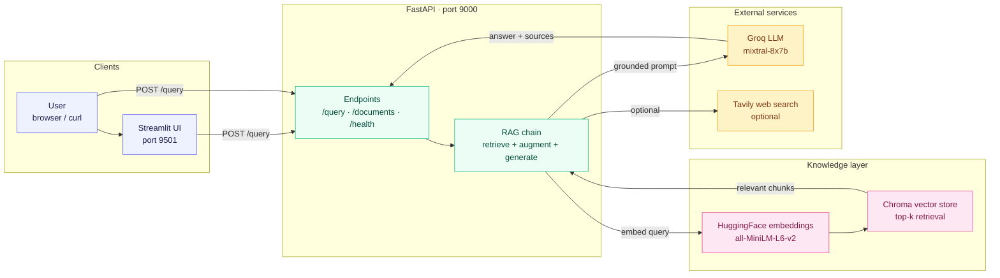
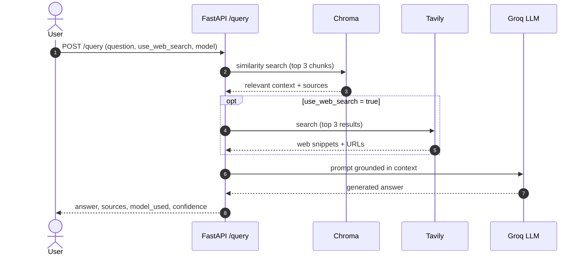
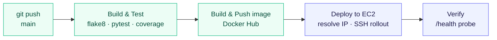

# RAG Fullstack — Docker · AWS · CI/CD

A production-style **Retrieval-Augmented Generation** service: upload your documents, ask questions, get grounded answers with sources. FastAPI backend, Streamlit UI, Chroma vector store, and a Groq-hosted LLM — containerized, tested in CI, and continuously deployed to AWS EC2.

<p align="left">
  
  
  
  
  
  
  
  
  
</p>

---

## 🔗 Live demo

| Surface | URL |
|---------|-----|
| 🎨 **Streamlit UI** | http://100.27.34.29:9501 |
| ⚡ **API (Swagger)** | http://100.27.34.29:9000/docs |
| ❤️ **Health** | http://100.27.34.29:9000/health |

> Running on a single EC2 instance. The LLM needs an API key to answer; without one the API stays up and returns a clear "key not configured" message instead of crashing (see [Design decisions](#-design-decisions--trade-offs)).

---

## 🎯 What this project demonstrates

This is a portfolio project built to show the *whole* lifecycle of a RAG service — not just a notebook that calls an LLM.

| Competency | Where to look |
|------------|---------------|
| **RAG pipeline design** | Chunk → embed → store → retrieve → augment prompt → generate, in [backend/main.py](backend/main.py) |
| **Clean API design** | Typed Pydantic request/response models, 7 documented endpoints, auto-generated OpenAPI |
| **Graceful degradation** | Missing LLM / vector store / web-search keys never crash the service — they downgrade features |
| **Lazy initialization** | Heavy models (embeddings, LLM) load on first use, so the container boots and health-checks instantly |
| **Containerization** | Single reproducible image runs both API and UI; same image deployed to EC2 |
| **CI/CD** | Lint → test+coverage → build → push → deploy, gated so prod only sees tested images |
| **Cloud deployment** | GitHub Actions resolves the EC2 IP at runtime and rolls out over SSH |
| **Full-stack delivery** | A real Streamlit UI a non-technical reviewer can actually click through |

---

## 🏗️ Architecture

### System overview



### Document ingestion

A document becomes searchable knowledge in five steps:


### Query lifecycle



### CI/CD pipeline



The pipeline is **staged**: the Docker build only runs after lint and tests pass, and the EC2 deploy only runs on `main`. A broken commit fails before it can be packaged or shipped.

---

## 🧠 Design decisions & trade-offs

The choices a reviewer would actually ask about — and the honest reasoning.

| Decision | Why | Trade-off accepted |
|----------|-----|--------------------|
| **Lazy-load models** | Embeddings + LLM clients are expensive to construct; deferring them keeps boot and `/health` instant, so health checks and CI never time out. | First real query pays the warm-up cost. |
| **Degrade, don't crash, on missing keys** | The service should boot in any environment — a fork, CI, a demo without secrets — and tell you what's missing rather than 500. | A misconfigured key surfaces as a polite "not configured" answer, not a loud failure. |
| **Chroma over a managed vector DB** | Zero external infra; embeds and persists locally — perfect for a single-node demo. | Not multi-node; index lives on the instance's disk. Pinecone/pgvector are the scale-up path. |
| **`all-MiniLM-L6-v2` embeddings** | Small, fast, runs on CPU, strong quality-for-size — no GPU bill. | Lower ceiling than large embedding models for nuanced retrieval. |
| **Groq-hosted Mixtral** | Very low latency and a generous free tier — great demo UX. | Single hosted provider; multi-provider routing is on the roadmap. |
| **Opt-in web search (Tavily)** | Keeps answers grounded in *your* documents by default; the web is an explicit choice. | Off by default means no live-web answers unless you toggle it. |
| **One image, two processes** | Simplest reproducible artifact for a demo; the exact bytes tested are the bytes deployed. | API and UI share a lifecycle; at scale they'd be separate images/services. |

---

## 📡 API reference

Base URL (local): `http://localhost:8000` · Interactive docs at `/docs`.

| Method | Endpoint | Purpose |
|--------|----------|---------|
| `GET` | `/health` | Readiness probe used by Docker and CI |
| `POST` | `/query` | Ask a question against indexed documents (and optionally the web) |
| `POST` | `/documents/upload` | Upload + index a PDF / TXT / DOCX |
| `GET` | `/documents` | List indexed documents |
| `DELETE` | `/documents/{filename}` | Remove a document and its embeddings |
| `GET` | `/models` | List selectable LLM models |
| `GET` | `/` | API metadata |

### `POST /query`

**Request**

```json
{
  "question": "What does the document say about refunds?",
  "use_web_search": false,
  "model": "groq",
  "temperature": 0.7,
  "max_tokens": 1000
}
```

**Response**

```json
{
  "question": "What does the document say about refunds?",
  "answer": "The policy allows refunds within 30 days...",
  "sources": ["policy.pdf"],
  "model_used": "groq",
  "confidence": 0.85
}
```

`confidence` is a transparency heuristic — higher when the answer was grounded in retrieved document context, lower when the model fell back on its own knowledge. The `model` field is carried through the contract and echoed back; **Groq (Mixtral 8x7B) is the wired provider today** — additional providers are on the roadmap.

```bash
curl -X POST http://localhost:8000/query \
  -H "Content-Type: application/json" \
  -d '{"question": "What is RAG?", "use_web_search": false}'
```

---

## ⚙️ How retrieval works

| Stage | Implementation |
|-------|----------------|
| **Loaders** | `PyPDFLoader` (PDF), `TextLoader` (TXT), `UnstructuredWordDocumentLoader` (DOCX) |
| **Chunking** | `RecursiveCharacterTextSplitter`, 1000-char chunks, 200-char overlap |
| **Embeddings** | `sentence-transformers/all-MiniLM-L6-v2` (HuggingFace, CPU) |
| **Vector store** | Chroma, persisted locally, collection `documents` |
| **Retrieval** | Top-3 similarity search; chunk `source` metadata returned as citations |
| **Augmentation** | Retrieved context (+ optional Tavily web snippets) injected into the prompt |
| **Generation** | Groq `mixtral-8x7b-32768` via LangChain LCEL chain |

---

## 🚀 Run it locally

### Option A — Docker Compose (recommended)

```bash
git clone https://github.com/Amith-Ganta/Rag-fullstack-docker-AWS.git
cd Rag-fullstack-docker-AWS

cp .env.example .env        # then add your GROQ_API_KEY (and TAVILY_API_KEY for web search)
docker-compose up --build
```

- API → http://localhost:8000/docs
- UI → http://localhost:8501

### Option B — Local Python

```bash
python -m venv venv && source venv/bin/activate    # Windows: venv\Scripts\activate
pip install -r requirements.txt
cp .env.example .env                                # add your keys

uvicorn backend.main:app --reload --port 8000       # terminal 1
streamlit run frontend/app.py --server.port 8501    # terminal 2
```

The app runs **without any keys** — you just get a "key not configured" answer until you add `GROQ_API_KEY`.

---

## 🔄 CI/CD & deployment

Defined in [.github/workflows/ci-cd.yml](.github/workflows/ci-cd.yml). On push to `main`:

1. **Build & Test** — `flake8` lint, `pytest` with coverage, upload to Codecov.
2. **Build & Push** — Docker Buildx builds the image and pushes tagged variants to Docker Hub (with GitHub Actions layer cache).
3. **Deploy to EC2** — resolves the instance's public IP from its instance ID, copies the SSH key, and rolls out two containers: `rag-backend` on `9000` and `rag-frontend` on `9501`, both `--restart unless-stopped`.
4. **Verify** — polls `/health` until the live API responds.

### Required GitHub secrets

| Secret | Purpose |
|--------|---------|
| `DOCKER_USERNAME` / `DOCKER_TOKEN` | Docker Hub publish |
| `AWS_ACCESS_KEY_ID` / `AWS_SECRET_ACCESS_KEY` | Resolve EC2 IP + deploy |
| `EC2_SSH_PRIVATE_KEY` | Base64-encoded EC2 private key (PEM) for SSH |

> **Security note:** the EC2 key only ever lives in GitHub's encrypted secrets and is written to a temp file that's deleted at the end of the deploy step — it is never committed. Lock SSH (port 22) to known IPs in the instance's security group.

---

## 📂 Project structure

```
Rag-fullstack-docker-AWS/
├── backend/
│   └── main.py                 # FastAPI app: RAG chain, document + query endpoints
├── frontend/
│   └── app.py                  # Streamlit UI: Q&A, document manager, settings
├── tests/
│   └── test_api.py             # pytest suite (health, query, documents, models)
├── .github/workflows/
│   └── ci-cd.yml               # lint → test → build → push → deploy
├── Dockerfile                  # Python 3.10-slim, non-root, runs API + UI
├── docker-compose.yml          # Local full-stack with healthcheck
├── requirements.txt
├── .env.example                # Configuration template
├── SETUP.md                    # Step-by-step setup & deployment guide
└── README.md
```

---

## 🗺️ Roadmap

Honest next steps if this were taken toward production:

- [ ] **Multi-provider LLM routing** — wire DeepSeek / OpenAI behind the existing `model` field.
- [ ] **Persistent vector store** — move Chroma to a volume or swap in pgvector/Pinecone so the index survives redeploys.
- [ ] **AuthN/AuthZ** — API keys or OAuth; the API is currently open + CORS-`*`.
- [ ] **Streaming responses** — token streaming to the UI for better perceived latency.
- [ ] **Observability** — structured request logs, latency metrics, and a `/metrics` endpoint.
- [ ] **Per-process images** — split API and UI into separate images for independent scaling.

---

## 🛠️ Troubleshooting

| Symptom | Fix |
|---------|-----|
| Answers say *"LLM API key not configured"* | Set `GROQ_API_KEY` in `.env` (or the container env) and restart. |
| Web search returns nothing | Set `TAVILY_API_KEY` **and** toggle *Enable Web Search* in the UI / pass `use_web_search: true`. |
| UI shows *"API Offline"* | The backend isn't reachable at `API_URL`; check it's running and the port matches. |
| Port already in use | Stop whatever holds `8000`/`8501`, or remap ports in `docker-compose.yml`. |
| Uploaded doc not indexed | Only `.pdf`, `.txt`, `.docx` are supported; check the API logs for the loader error. |

---

## 📝 License

[MIT](LICENSE) © 2026 Amith Ganta
